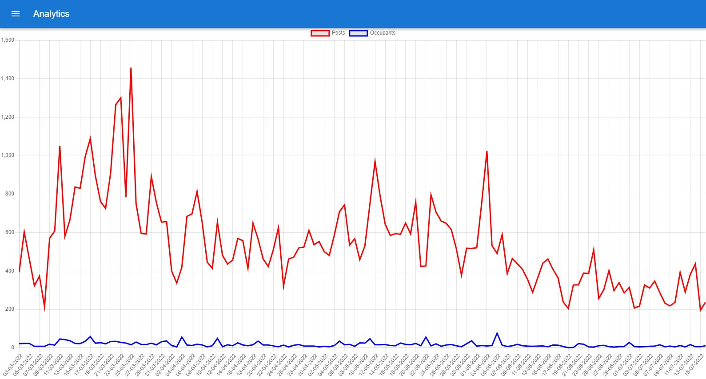

# Occupant Search

The service searches for dead russians mentioned in [VKontakte](https:://vk.com). Features:
1. Uses [VK API](https://github.com/VKCOM/vk-java-sdk) to search for posts
2. [Periodic refresh of new posts](server/src/main/kotlin/com/occupantsearch/refresh/UpdateController.kt)
3. [Name detection in the post's text](server/src/main/kotlin/com/occupantsearch/person/PersonTextSearcher.kt)
4. [Face detection](server/src/main/kotlin/com/occupantsearch/image) using [OpenCV](https://opencv.org/)
5. Filter by name
6. [JSON file storage, loaded and stored in memory](server/src/main/kotlin/com/occupantsearch/db)
7. Pagination
8. [Posts count by date analytics](server/src/main/kotlin/com/occupantsearch/analytics/AnalyticsController.kt) + [chartjs](https://www.chartjs.org/)
9. WebApp styled with [MUI](https://mui.com/)
10. [Export JSON/CSV](server/src/main/kotlin/com/occupantsearch/export/ExportController.kt)
11. [Popular VK groups](server/src/main/kotlin/com/occupantsearch/group/GroupDownloader.kt)
12. Fetch location from post text using [natasha NLP](https://github.com/natasha/natasha)
13. [Show occupants on map](server/src/main/kotlin/com/occupantsearch/geo)

## Usage

### Server
[Kotlin + ktor](server)

To run locally:
```
./gradlew :server:devRun
```
Server is started at port `8080`.

### Client
[Typescript + React](client)

To run locally:
```
cd client
npm install
npm run
```
Open [localhost:3000](http://localhost:3000). Hot code reload is enabled.

### Production build
```
./gradlew :server:assembleDist
```
Webapp will output into [`server/src/resources/app`](client/.env).

See [deployment script](deployment/deploy.sh) for script which is used by [Github actions](https://github.com/artemstorozhuk/OccupantSearch/actions).

## Demo
Demo hosted at my Raspberry PI: [http://81.102.49.163:8080/](http://81.102.49.163:8080/)





## Load test

Run from console:
```
./gradlew :loadtest:run
```

## Contributing

Open PR and ping me.

## License
What is this?